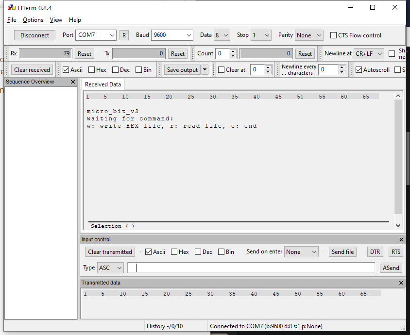
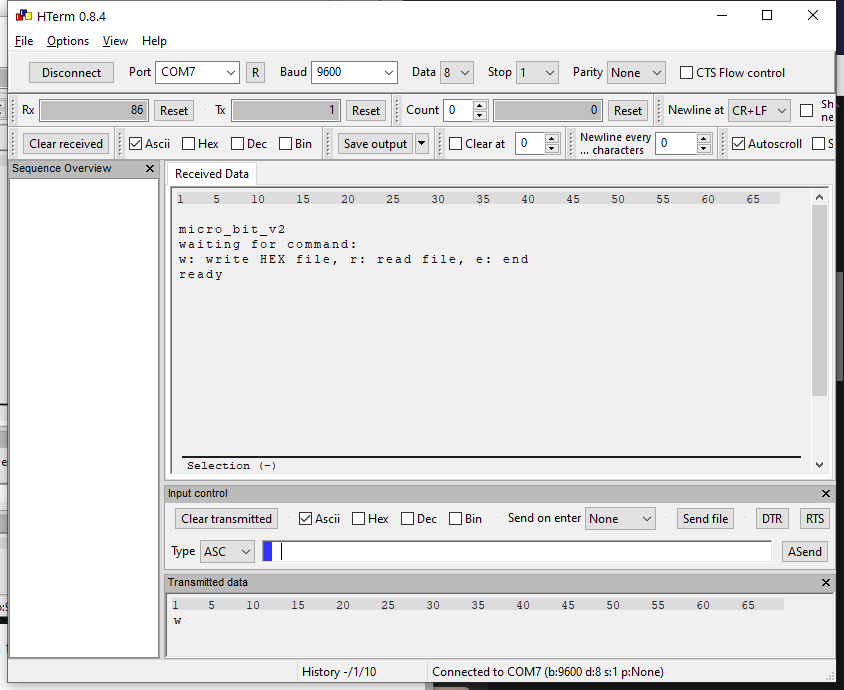
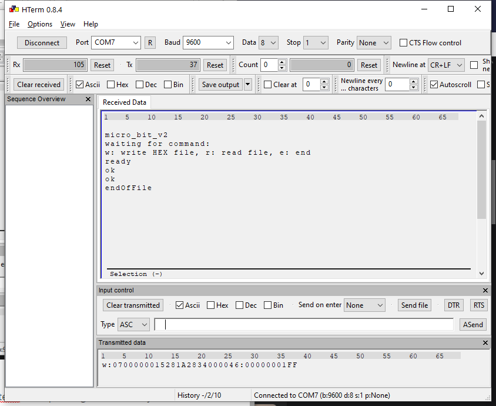
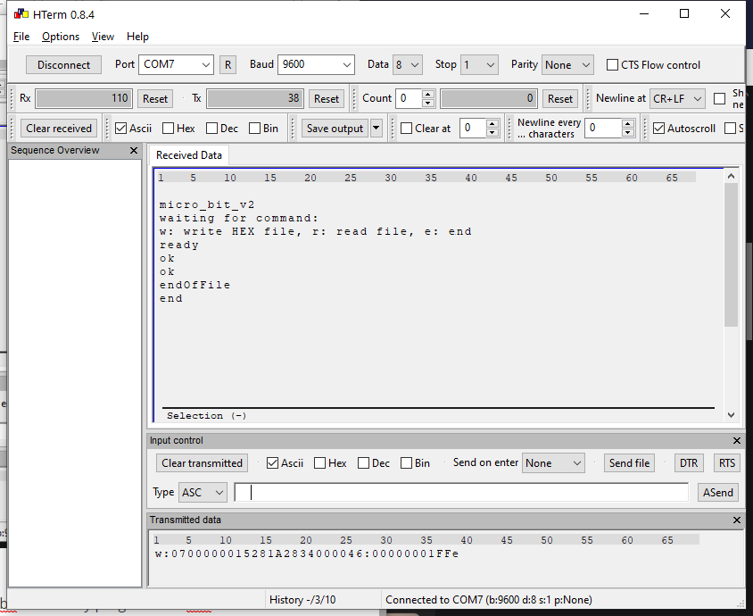

# Manual Serial TPS Programming

Sometimes it's useful to manualle program the TPS/SPS only with a terminal program. (Useful if you try to program via mobile, tablett...)

For manually serial programming you'll need a terminal program. For the PC I like hterm, but there are many different apps out.

For serial programming you'll need the COM port (determine on windows as shown in the video). Simply open the COMport with 9600 baud 8N1. 

Then reset the microbit with **A** pressed. When you see the diamond, in the terminal you will see the output of the microbit. (Show above) The microbit will show you the possible command. With **r** you can readout the loaded TPS file as HEX.

Then press **w** in the input field of hterm:

you will see `ready` as answer and an arrow down on the microbit.

Now you can copy your hex file line by line into the input field of the hterm. After pressing enter on every line, the microbit should answer with `ok`. After the last line the microbit will answer with `endoffile`.

Now pressing **e** will end the programming mode. 
microbit will answer with `end` and than restart. The newly programmed TPS file should now run.

